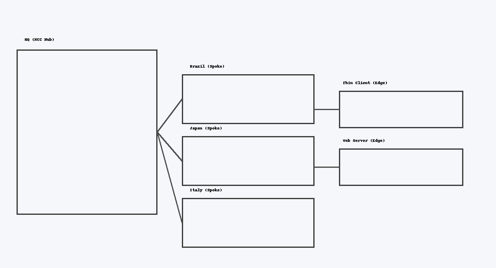

# GCP NCC Hub & Global Spokes

Headline: Designed a global hub-and-spoke network with Google Cloud Network Connectivity Center (NCC).

## Overview
- Goal: Connect international test sites (Brazil, Japan, Italy) to an HQ hub with HA VPN + BGP.
- Scope: Multi-VPC architecture; Thin Client Server (edge), Web Server (edge), HQ hub (center).
- Cloud: GCP (primary).

## Tools & Tech
Cloud (GCP NCC, HA VPN, Cloud Router) · Terraform (modules: hq_hub, foreign_vpn, web_server_vpc) · BGP · IAM · Firewalls · GitHub

## Problem
Centralize networking for multiple countries while keeping Thin Client access restricted and Web Server globally reachable.

## Solution
- Hub-and-spoke via NCC Hub in hq_vpc.
- HA VPN tunnels + Cloud Router BGP sessions for each country VPC.
- Edge spokes: Thin Client (Brazil/Japan only) and Web Server (global).
- Modular Terraform for repeatable deployments.

## Architecture


## Deploy (Quick Start)
```bash
terraform init
terraform apply -target=module.hq_hub
terraform apply -target=module.foreign_vpn["japan"]
# repeat for brazil, italy
```
Validate with ping/traceroute between spokes.

## Results
- End-to-end HQ <-> Brazil/Japan/Italy connectivity (BGP routes propagated).
- Policy: Thin Client restricted; Web Server globally reachable.
- Easy to add new spokes via variables.

## Security
Least-privilege IAM, restricted SSH (IAP), test-only ICMP rule, distinct ASNs per region.

## Lessons
BGP peer alignment is critical. Modularize early. NCC simplifies global routing at scale.

## Repo
- Terraform: Add link to GitHub module(s).